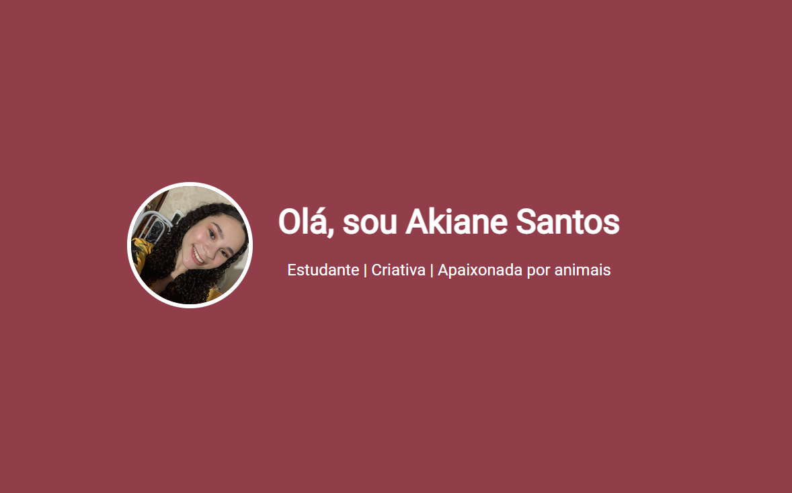

# 🌸 Portfólio - Akiane Santos

Este é o meu **site portfólio pessoal**, criado para apresentar minhas habilidades, projetos e informações de contato.  
O objetivo é mostrar um pouco sobre mim, minha trajetória e os trabalhos que desenvolvi.



---

## 📌 Sobre o Projeto

O site foi desenvolvido utilizando **HTML5** e **CSS3**, com foco em um design limpo, responsivo e alinhado à minha identidade visual.

Ele contém:
- **Apresentação** com minha foto e breve descrição.
- **Seção "Sobre Mim"** contando um pouco da minha história e objetivos.
- **Seção "Projetos"** com destaque para trabalhos que já desenvolvi.
- **Seção de Contato** com formas de falar comigo.
- **Rodapé** com direitos autorais.

---

## 🛠 Tecnologias Utilizadas

- **HTML5** → Estrutura do site.
- **CSS3** → Estilização e responsividade.
- **Google Fonts** → Fontes *Montserrat* e *Roboto*.
- **Design Responsivo** → Ajuste automático para diferentes tamanhos de tela.

---

## 📂 Estrutura de Pastas

```plaintext
/
├── index.html          # Arquivo principal HTML
├── main.css            # Estilos do site
├── Akiane.png          # Foto de apresentação
├── Raizes.png          # Imagem do projeto Raízes do Araguaia
├── Kalua.png           # Imagem do projeto Kalua
└── README.md           # Documentação do projeto
